# 🗄️ 알프레도 ERD (Entity Relationship Diagram)

> **버전**: v1.0  
> **작성일**: 2025-01-11  
> **목표**: Q1 MVP 완성을 위한 전체 데이터베이스 스키마 설계

---

## 📊 전체 ERD 다이어그램

```mermaid
erDiagram
    %% ========== 핵심 사용자 ========== %%
    users ||--o{ user_settings : has
    users ||--o{ tasks : creates
    users ||--o{ habits : creates
    users ||--o{ focus_sessions : creates
    users ||--o{ daily_conditions : logs
    users ||--o{ conversations : has
    users ||--|| penguin_status : has
    users ||--o{ calendar_events : syncs
    users ||--o{ calendar_insights : has

    %% ========== 대화 시스템 ========== %%
    conversations ||--o{ messages : contains
    conversations ||--o{ conversation_summaries : generates
    
    %% ========== 게이미피케이션 ========== %%
    penguin_status ||--o{ penguin_items : owns
    penguin_status ||--o{ xp_history : tracks
    
    %% ========== 습관 & 태스크 ========== %%
    habits ||--o{ habit_logs : records
    tasks ||--o{ task_history : tracks
    
    %% ========== 리포트 ========== %%
    users ||--o{ daily_summaries : generates
    users ||--o{ weekly_insights : generates

    %% ========== 테이블 정의 ========== %%
    users {
        uuid id PK
        string email UK
        string name
        string picture
        string google_id UK
        boolean is_onboarded
        timestamp created_at
        timestamp updated_at
    }

    user_settings {
        uuid id PK
        uuid user_id FK
        string tone_preset
        json tone_axes
        string privacy_level
        string default_view
        json notifications
        json priority_weights
        json onboarding_answers
        timestamp created_at
        timestamp updated_at
    }

    tasks {
        uuid id PK
        uuid user_id FK
        string title
        text description
        string status
        string category
        boolean is_starred
        boolean is_top_three
        date due_date
        time due_time
        int estimated_minutes
        int actual_minutes
        int defer_count
        json tags
        json subtasks
        timestamp completed_at
        timestamp created_at
        timestamp updated_at
    }

    task_history {
        uuid id PK
        uuid task_id FK
        string action
        json old_value
        json new_value
        timestamp created_at
    }

    habits {
        uuid id PK
        uuid user_id FK
        string title
        text description
        string frequency
        json target_days
        int current_streak
        int best_streak
        int total_completions
        boolean is_active
        timestamp created_at
        timestamp updated_at
    }

    habit_logs {
        uuid id PK
        uuid habit_id FK
        date log_date
        boolean completed
        text note
        timestamp created_at
    }

    focus_sessions {
        uuid id PK
        uuid user_id FK
        uuid task_id FK
        string mode
        int planned_minutes
        int actual_minutes
        int breaks_taken
        string end_reason
        timestamp started_at
        timestamp ended_at
    }

    daily_conditions {
        uuid id PK
        uuid user_id FK
        date log_date UK
        int energy_level
        int mood_level
        int focus_level
        json factors
        text note
        timestamp created_at
        timestamp updated_at
    }

    penguin_status {
        uuid id PK
        uuid user_id FK
        string name
        int level
        int current_xp
        int total_xp
        int coins
        string current_mood
        string current_outfit
        json unlocked_items
        json achievements
        timestamp last_interaction
        timestamp created_at
        timestamp updated_at
    }

    penguin_items {
        uuid id PK
        string item_id UK
        string name
        string category
        string rarity
        int price
        string image_url
        boolean is_default
    }

    xp_history {
        uuid id PK
        uuid penguin_id FK
        int amount
        string source
        string description
        timestamp created_at
    }

    conversations {
        uuid id PK
        uuid user_id FK
        string type
        string context
        timestamp started_at
        timestamp ended_at
    }

    messages {
        uuid id PK
        uuid conversation_id FK
        string role
        text content
        json metadata
        timestamp created_at
    }

    conversation_summaries {
        uuid id PK
        uuid conversation_id FK
        text summary
        json extracted_tasks
        json extracted_insights
        timestamp created_at
    }

    calendar_events {
        uuid id PK
        uuid user_id FK
        string google_event_id UK
        string title
        timestamp start_time
        timestamp end_time
        boolean is_all_day
        string location
        int attendee_count
        string category
        string importance
        string energy_drain
        timestamp synced_at
    }

    calendar_insights {
        uuid id PK
        uuid user_id FK
        string insight_type
        json insight_data
        int confidence
        boolean is_validated
        timestamp created_at
        timestamp updated_at
    }

    briefings {
        uuid id PK
        uuid user_id FK
        string type
        text content
        json context_data
        boolean was_read
        timestamp created_at
    }

    daily_summaries {
        uuid id PK
        uuid user_id FK
        date summary_date UK
        int tasks_completed
        int tasks_deferred
        int focus_minutes
        int meetings_attended
        json mood_trend
        json highlights
        json areas_for_improvement
        int productivity_score
        timestamp created_at
    }

    weekly_insights {
        uuid id PK
        uuid user_id FK
        date week_start UK
        json patterns_discovered
        json correlations
        json recommendations
        json achievements
        int overall_score
        timestamp created_at
    }
```



---

## 📁 테이블 상세 명세

### 1. Core - 핵심 사용자

#### `users` - 사용자 기본 정보
| 컬럼 | 타입 | 제약 | 설명 |
|------|------|------|------|
| id | UUID | PK | 고유 식별자 |
| email | VARCHAR(255) | UK, NOT NULL | 이메일 주소 |
| name | VARCHAR(100) | NOT NULL | 표시 이름 |
| picture | TEXT | - | 프로필 이미지 URL |
| google_id | VARCHAR(255) | UK | Google OAuth ID |
| is_onboarded | BOOLEAN | DEFAULT false | 온보딩 완료 여부 |
| created_at | TIMESTAMP | NOT NULL | 생성 시간 |
| updated_at | TIMESTAMP | NOT NULL | 수정 시간 |

#### `user_settings` - 사용자 설정
| 컬럼 | 타입 | 제약 | 설명 |
|------|------|------|------|
| id | UUID | PK | 고유 식별자 |
| user_id | UUID | FK, UK | users.id 참조 |
| tone_preset | VARCHAR(50) | NOT NULL | 톤 프리셋 (gentle_friend, mentor, ceo, cheerleader, silent_partner) |
| tone_axes | JSONB | NOT NULL | 5축 톤 설정 {warmth, proactivity, directness, humor, pressure} |
| privacy_level | VARCHAR(20) | NOT NULL | 프라이버시 레벨 (open_book, selective, minimal) |
| default_view | VARCHAR(20) | NOT NULL | 기본 뷰 모드 (integrated, work, life) |
| notifications | JSONB | NOT NULL | 알림 설정 |
| priority_weights | JSONB | NOT NULL | 우선순위 가중치 |
| onboarding_answers | JSONB | - | 온보딩 응답 데이터 |
| created_at | TIMESTAMP | NOT NULL | 생성 시간 |
| updated_at | TIMESTAMP | NOT NULL | 수정 시간 |

---

### 2. Tasks - 태스크 관리

#### `tasks` - 태스크
| 컬럼 | 타입 | 제약 | 설명 |
|------|------|------|------|
| id | UUID | PK | 고유 식별자 |
| user_id | UUID | FK, NOT NULL | users.id 참조 |
| title | VARCHAR(500) | NOT NULL | 태스크 제목 |
| description | TEXT | - | 상세 설명 |
| status | VARCHAR(20) | NOT NULL | 상태 (todo, in_progress, done, deferred) |
| category | VARCHAR(20) | NOT NULL | 카테고리 (work, life) |
| is_starred | BOOLEAN | DEFAULT false | 중요 표시 |
| is_top_three | BOOLEAN | DEFAULT false | 오늘의 탑3 |
| due_date | DATE | - | 마감일 |
| due_time | TIME | - | 마감 시간 |
| estimated_minutes | INT | - | 예상 소요 시간 (분) |
| actual_minutes | INT | - | 실제 소요 시간 (분) |
| defer_count | INT | DEFAULT 0 | 미룬 횟수 |
| tags | JSONB | DEFAULT '[]' | 태그 배열 |
| subtasks | JSONB | DEFAULT '[]' | 하위 태스크 (Magic ToDo 분해용) |
| completed_at | TIMESTAMP | - | 완료 시간 |
| created_at | TIMESTAMP | NOT NULL | 생성 시간 |
| updated_at | TIMESTAMP | NOT NULL | 수정 시간 |

**인덱스:**
- `idx_tasks_user_status` (user_id, status)
- `idx_tasks_user_date` (user_id, due_date)
- `idx_tasks_top_three` (user_id, is_top_three) WHERE is_top_three = true

#### `task_history` - 태스크 변경 이력
| 컬럼 | 타입 | 제약 | 설명 |
|------|------|------|------|
| id | UUID | PK | 고유 식별자 |
| task_id | UUID | FK, NOT NULL | tasks.id 참조 |
| action | VARCHAR(50) | NOT NULL | 액션 유형 (created, updated, deferred, completed, deleted) |
| old_value | JSONB | - | 이전 값 |
| new_value | JSONB | - | 새 값 |
| created_at | TIMESTAMP | NOT NULL | 생성 시간 |

---

### 3. Habits - 습관 관리

#### `habits` - 습관 정의
| 컬럼 | 타입 | 제약 | 설명 |
|------|------|------|------|
| id | UUID | PK | 고유 식별자 |
| user_id | UUID | FK, NOT NULL | users.id 참조 |
| title | VARCHAR(200) | NOT NULL | 습관 이름 |
| description | TEXT | - | 설명 |
| frequency | VARCHAR(20) | NOT NULL | 빈도 (daily, weekly, custom) |
| target_days | JSONB | - | 목표 요일 [0-6] (월-일) |
| current_streak | INT | DEFAULT 0 | 현재 스트릭 |
| best_streak | INT | DEFAULT 0 | 최고 스트릭 |
| total_completions | INT | DEFAULT 0 | 총 완료 횟수 |
| is_active | BOOLEAN | DEFAULT true | 활성화 여부 |
| created_at | TIMESTAMP | NOT NULL | 생성 시간 |
| updated_at | TIMESTAMP | NOT NULL | 수정 시간 |

#### `habit_logs` - 습관 기록
| 컬럼 | 타입 | 제약 | 설명 |
|------|------|------|------|
| id | UUID | PK | 고유 식별자 |
| habit_id | UUID | FK, NOT NULL | habits.id 참조 |
| log_date | DATE | NOT NULL | 기록 날짜 |
| completed | BOOLEAN | NOT NULL | 완료 여부 |
| note | TEXT | - | 메모 |
| created_at | TIMESTAMP | NOT NULL | 생성 시간 |

**인덱스:**
- `idx_habit_logs_date` (habit_id, log_date) UNIQUE

---

### 4. Focus - 집중 세션

#### `focus_sessions` - 집중 타이머 세션
| 컬럼 | 타입 | 제약 | 설명 |
|------|------|------|------|
| id | UUID | PK | 고유 식별자 |
| user_id | UUID | FK, NOT NULL | users.id 참조 |
| task_id | UUID | FK | tasks.id 참조 (선택) |
| mode | VARCHAR(30) | NOT NULL | 모드 (pomodoro, flow, body_double, deep_work) |
| planned_minutes | INT | NOT NULL | 계획 시간 (분) |
| actual_minutes | INT | - | 실제 시간 (분) |
| breaks_taken | INT | DEFAULT 0 | 휴식 횟수 |
| end_reason | VARCHAR(30) | - | 종료 사유 (completed, interrupted, abandoned) |
| started_at | TIMESTAMP | NOT NULL | 시작 시간 |
| ended_at | TIMESTAMP | - | 종료 시간 |

---

### 5. Conditions - 컨디션 & 웰니스

#### `daily_conditions` - 일일 컨디션
| 컬럼 | 타입 | 제약 | 설명 |
|------|------|------|------|
| id | UUID | PK | 고유 식별자 |
| user_id | UUID | FK, NOT NULL | users.id 참조 |
| log_date | DATE | NOT NULL | 기록 날짜 |
| energy_level | INT | CHECK 1-5 | 에너지 레벨 (1-5) |
| mood_level | INT | CHECK 1-5 | 기분 레벨 (1-5) |
| focus_level | INT | CHECK 1-5 | 집중력 레벨 (1-5) |
| factors | JSONB | DEFAULT '[]' | 영향 요인 (sleep_quality, exercise, stress 등) |
| note | TEXT | - | 메모 |
| created_at | TIMESTAMP | NOT NULL | 생성 시간 |
| updated_at | TIMESTAMP | NOT NULL | 수정 시간 |

**인덱스:**
- `idx_conditions_user_date` (user_id, log_date) UNIQUE

---

### 6. Penguin - 펭귄 게이미피케이션

#### `penguin_status` - 펭귄 상태
| 컬럼 | 타입 | 제약 | 설명 |
|------|------|------|------|
| id | UUID | PK | 고유 식별자 |
| user_id | UUID | FK, UK | users.id 참조 |
| name | VARCHAR(50) | DEFAULT '알프레도' | 펭귄 이름 |
| level | INT | DEFAULT 1 | 레벨 |
| current_xp | INT | DEFAULT 0 | 현재 경험치 (레벨 내) |
| total_xp | INT | DEFAULT 0 | 누적 경험치 |
| coins | INT | DEFAULT 0 | 보유 코인 |
| current_mood | VARCHAR(30) | DEFAULT 'happy' | 현재 기분 |
| current_outfit | VARCHAR(50) | - | 현재 착용 아이템 |
| unlocked_items | JSONB | DEFAULT '[]' | 해금된 아이템 ID 배열 |
| achievements | JSONB | DEFAULT '[]' | 달성한 업적 배열 |
| last_interaction | TIMESTAMP | - | 마지막 상호작용 |
| created_at | TIMESTAMP | NOT NULL | 생성 시간 |
| updated_at | TIMESTAMP | NOT NULL | 수정 시간 |

#### `penguin_items` - 펭귄 아이템 카탈로그
| 컬럼 | 타입 | 제약 | 설명 |
|------|------|------|------|
| id | UUID | PK | 고유 식별자 |
| item_id | VARCHAR(50) | UK | 아이템 코드 |
| name | VARCHAR(100) | NOT NULL | 아이템 이름 |
| category | VARCHAR(30) | NOT NULL | 카테고리 (hat, accessory, background, effect) |
| rarity | VARCHAR(20) | NOT NULL | 희귀도 (common, rare, epic, legendary) |
| price | INT | NOT NULL | 코인 가격 |
| image_url | TEXT | NOT NULL | 이미지 URL |
| is_default | BOOLEAN | DEFAULT false | 기본 제공 여부 |

#### `xp_history` - 경험치 히스토리
| 컬럼 | 타입 | 제약 | 설명 |
|------|------|------|------|
| id | UUID | PK | 고유 식별자 |
| penguin_id | UUID | FK, NOT NULL | penguin_status.id 참조 |
| amount | INT | NOT NULL | 획득/소모 XP |
| source | VARCHAR(50) | NOT NULL | 출처 (task_complete, habit_streak, focus_session 등) |
| description | VARCHAR(200) | - | 설명 |
| created_at | TIMESTAMP | NOT NULL | 생성 시간 |

---

### 7. Conversations - AI 대화

#### `conversations` - 대화 세션
| 컬럼 | 타입 | 제약 | 설명 |
|------|------|------|------|
| id | UUID | PK | 고유 식별자 |
| user_id | UUID | FK, NOT NULL | users.id 참조 |
| type | VARCHAR(30) | NOT NULL | 타입 (chat, briefing, nudge, onboarding) |
| context | VARCHAR(100) | - | 컨텍스트 (morning, evening, task_help 등) |
| started_at | TIMESTAMP | NOT NULL | 시작 시간 |
| ended_at | TIMESTAMP | - | 종료 시간 |

#### `messages` - 메시지
| 컬럼 | 타입 | 제약 | 설명 |
|------|------|------|------|
| id | UUID | PK | 고유 식별자 |
| conversation_id | UUID | FK, NOT NULL | conversations.id 참조 |
| role | VARCHAR(20) | NOT NULL | 역할 (user, assistant, system) |
| content | TEXT | NOT NULL | 메시지 내용 |
| metadata | JSONB | - | 메타데이터 (토큰 수, 모델 등) |
| created_at | TIMESTAMP | NOT NULL | 생성 시간 |

#### `conversation_summaries` - 대화 요약
| 컬럼 | 타입 | 제약 | 설명 |
|------|------|------|------|
| id | UUID | PK | 고유 식별자 |
| conversation_id | UUID | FK, UK | conversations.id 참조 |
| summary | TEXT | NOT NULL | 요약 내용 |
| extracted_tasks | JSONB | - | 추출된 태스크 |
| extracted_insights | JSONB | - | 추출된 인사이트 |
| created_at | TIMESTAMP | NOT NULL | 생성 시간 |

---

### 8. Calendar - 캘린더 연동

#### `calendar_events` - 캘린더 이벤트 (캐시)
| 컬럼 | 타입 | 제약 | 설명 |
|------|------|------|------|
| id | UUID | PK | 고유 식별자 |
| user_id | UUID | FK, NOT NULL | users.id 참조 |
| google_event_id | VARCHAR(255) | UK | Google 이벤트 ID |
| title | VARCHAR(500) | NOT NULL | 이벤트 제목 |
| start_time | TIMESTAMP | NOT NULL | 시작 시간 |
| end_time | TIMESTAMP | NOT NULL | 종료 시간 |
| is_all_day | BOOLEAN | DEFAULT false | 종일 이벤트 |
| location | TEXT | - | 장소 |
| attendee_count | INT | DEFAULT 0 | 참석자 수 |
| category | VARCHAR(30) | - | 카테고리 (meeting, focus, personal, travel, meal, other) |
| importance | VARCHAR(20) | - | 중요도 (high, medium, low) |
| energy_drain | VARCHAR(20) | - | 에너지 소모 (high, medium, low) |
| synced_at | TIMESTAMP | NOT NULL | 동기화 시간 |

**인덱스:**
- `idx_calendar_user_time` (user_id, start_time)

#### `calendar_insights` - 캘린더 인사이트 (DNA 확장)
| 컬럼 | 타입 | 제약 | 설명 |
|------|------|------|------|
| id | UUID | PK | 고유 식별자 |
| user_id | UUID | FK, NOT NULL | users.id 참조 |
| insight_type | VARCHAR(50) | NOT NULL | 타입 (chronotype, energy_pattern, work_style, stress_signal 등) |
| insight_data | JSONB | NOT NULL | 인사이트 데이터 |
| confidence | INT | CHECK 1-3 | 확신도 (1-3, ⭐~⭐⭐⭐) |
| is_validated | BOOLEAN | DEFAULT false | 사용자 검증 여부 |
| created_at | TIMESTAMP | NOT NULL | 생성 시간 |
| updated_at | TIMESTAMP | NOT NULL | 수정 시간 |

---

### 9. Briefings - 브리핑

#### `briefings` - 브리핑 히스토리
| 컬럼 | 타입 | 제약 | 설명 |
|------|------|------|------|
| id | UUID | PK | 고유 식별자 |
| user_id | UUID | FK, NOT NULL | users.id 참조 |
| type | VARCHAR(30) | NOT NULL | 타입 (morning, evening, nudge, weekly) |
| content | TEXT | NOT NULL | 브리핑 내용 |
| context_data | JSONB | - | 컨텍스트 데이터 |
| was_read | BOOLEAN | DEFAULT false | 읽음 여부 |
| created_at | TIMESTAMP | NOT NULL | 생성 시간 |

---

### 10. Reports - 리포트 & 인사이트

#### `daily_summaries` - 일일 요약
| 컬럼 | 타입 | 제약 | 설명 |
|------|------|------|------|
| id | UUID | PK | 고유 식별자 |
| user_id | UUID | FK, NOT NULL | users.id 참조 |
| summary_date | DATE | NOT NULL | 요약 날짜 |
| tasks_completed | INT | DEFAULT 0 | 완료 태스크 수 |
| tasks_deferred | INT | DEFAULT 0 | 미룬 태스크 수 |
| focus_minutes | INT | DEFAULT 0 | 집중 시간 (분) |
| meetings_attended | INT | DEFAULT 0 | 참석 미팅 수 |
| mood_trend | JSONB | - | 기분 추이 |
| highlights | JSONB | - | 하이라이트 |
| areas_for_improvement | JSONB | - | 개선점 |
| productivity_score | INT | - | 생산성 점수 (0-100) |
| created_at | TIMESTAMP | NOT NULL | 생성 시간 |

**인덱스:**
- `idx_daily_summary_date` (user_id, summary_date) UNIQUE

#### `weekly_insights` - 주간 인사이트
| 컬럼 | 타입 | 제약 | 설명 |
|------|------|------|------|
| id | UUID | PK | 고유 식별자 |
| user_id | UUID | FK, NOT NULL | users.id 참조 |
| week_start | DATE | NOT NULL | 주 시작일 (월요일) |
| patterns_discovered | JSONB | - | 발견된 패턴 |
| correlations | JSONB | - | 상관관계 (예: "운동한 날 생산성 높음") |
| recommendations | JSONB | - | 추천 사항 |
| achievements | JSONB | - | 주간 업적 |
| overall_score | INT | - | 종합 점수 (0-100) |
| created_at | TIMESTAMP | NOT NULL | 생성 시간 |

**인덱스:**
- `idx_weekly_insights_week` (user_id, week_start) UNIQUE

---

## 📱 로컬 저장소 (IndexedDB)

서버와 별도로 오프라인 지원을 위한 로컬 스토리지:

```typescript
// Dexie 스키마
{
  tasks: 'id, status, category, isStarred, isTopThree, dueDate, createdAt',
  offlineQueue: 'id, action, table, createdAt',
  cache: 'key, expiresAt',
  calendar: 'id, startTime, category',
  briefings: 'id, type, createdAt',
  habits: 'id, frequency, createdAt'
}
```

---

## 🔄 데이터 흐름

```
┌─────────────────────────────────────────────────────────────────────┐
│                        사용자 상호작용                                │
└─────────────────────────────────────────────────────────────────────┘
                                   │
                                   ▼
┌─────────────────────────────────────────────────────────────────────┐
│                      IndexedDB (로컬 캐시)                           │
│   ┌─────────┐  ┌─────────┐  ┌─────────┐  ┌─────────┐               │
│   │  tasks  │  │ calendar│  │ habits  │  │briefings│               │
│   └─────────┘  └─────────┘  └─────────┘  └─────────┘               │
└─────────────────────────────────────────────────────────────────────┘
                                   │
                          오프라인 큐로 동기화
                                   │
                                   ▼
┌─────────────────────────────────────────────────────────────────────┐
│                      Supabase (PostgreSQL)                          │
│   ┌──────────────────────────────────────────────────────────────┐  │
│   │                        Core                                   │  │
│   │   users ──── user_settings                                    │  │
│   └──────────────────────────────────────────────────────────────┘  │
│   ┌──────────────────────────────────────────────────────────────┐  │
│   │                    Productivity                               │  │
│   │   tasks ──── task_history                                     │  │
│   │   habits ──── habit_logs                                      │  │
│   │   focus_sessions                                              │  │
│   └──────────────────────────────────────────────────────────────┘  │
│   ┌──────────────────────────────────────────────────────────────┐  │
│   │                    Gamification                               │  │
│   │   penguin_status ──── penguin_items                           │  │
│   │   xp_history                                                  │  │
│   └──────────────────────────────────────────────────────────────┘  │
│   ┌──────────────────────────────────────────────────────────────┐  │
│   │                    Intelligence                               │  │
│   │   conversations ──── messages ──── conversation_summaries     │  │
│   │   calendar_events ──── calendar_insights                      │  │
│   │   daily_conditions                                            │  │
│   └──────────────────────────────────────────────────────────────┘  │
│   ┌──────────────────────────────────────────────────────────────┐  │
│   │                    Reports                                    │  │
│   │   briefings                                                   │  │
│   │   daily_summaries ──── weekly_insights                        │  │
│   └──────────────────────────────────────────────────────────────┘  │
└─────────────────────────────────────────────────────────────────────┘
                                   │
                                   ▼
┌─────────────────────────────────────────────────────────────────────┐
│                      External Services                              │
│   ┌─────────────────┐  ┌─────────────────┐  ┌─────────────────┐    │
│   │ Google Calendar │  │   Google Gmail  │  │   Claude API    │    │
│   └─────────────────┘  └─────────────────┘  └─────────────────┘    │
└─────────────────────────────────────────────────────────────────────┘
```

---

## 📅 구현 로드맵

| 주차 | 테이블 | 우선순위 |
|------|--------|----------|
| **W1 (1/6-12)** | 현재 문서 완성 | 🔴 High |
| **W2 (1/13-19)** | `daily_conditions` | 🔴 High |
| **W3 (1/20-26)** | `penguin_status`, `penguin_items`, `xp_history`, `habits`, `habit_logs`, `tasks` (subtasks 추가), `focus_sessions` | 🔴 High |
| **W4 (1/27-31)** | `daily_summaries`, `weekly_insights` | 🟡 Medium |
| **2월** | `calendar_insights` (DNA 확장) | 🟡 Medium |

---

## 🔐 보안 고려사항

### Row Level Security (RLS)
모든 테이블에 RLS 적용:
```sql
-- 예시: tasks 테이블
ALTER TABLE tasks ENABLE ROW LEVEL SECURITY;

CREATE POLICY "Users can only access their own tasks"
ON tasks FOR ALL
USING (user_id = auth.uid());
```

### 민감 데이터
- `conversations.messages`: 암호화 고려
- `daily_conditions`: 건강 관련 데이터 - 별도 암호화
- `calendar_insights`: 패턴 데이터 - 익명화 필요시 처리

---

## 📝 변경 이력

| 날짜 | 버전 | 변경 내용 |
|------|------|----------|
| 2025-01-11 | v1.0 | Q1 로드맵 기반 ERD 전면 재설계 |
| 2024-12-XX | v0.1 | 초기 스키마 설계 |

---

*이 문서는 알프레도 Q1 MVP를 위한 데이터베이스 스키마 설계서입니다.*
